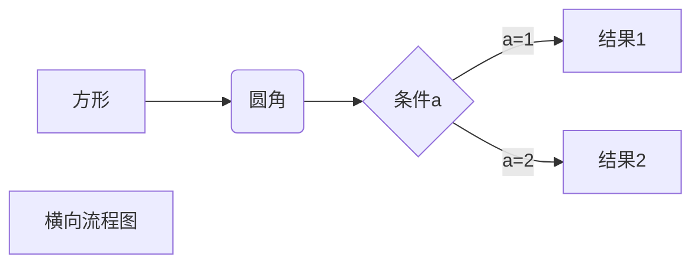

# Hello World!
## 二级标题
### 三级标题

## 段落格式
段落换行是使用两个以上空格加上回车    
第二段

或者加一个空行表示第三段

###字体
*斜体文本*   
_斜体文本_   
**粗体文本**   
__粗体文本__   
***粗斜体文本***   
___粗斜体文本___   
    
### 分隔线

***

* * *

---

### 删除线
~~删除线~~

### 下划线
<u>下划线</u>

### 脚注
[^脚注]

[^脚注]:ll


## 列表

* one
* two
* three

+ one
+ two

- one
- two   

1. one
2. two
3. three    
    - one   
    - two    
4. four    
    - one    
    - two    
     
## 区块
> 区块引用    
> 菜鸟教程    
> 最外层嵌套    
>> 第一层嵌套
>>>第二层嵌套


> 区块中使用列表
> 1. one
> 2. two
> + one
> + two

* one
    > 区块1       
         区块2      
  
    > 区块2
      
* two

- [x] This is a complete item
- [ ] This is an incomplete item

## MD代码
`printf()`函数

### 代码区块
    <?php
    echo 'MD';
    function test() {
        echo 'test'
    }
    
    

```python
print('hello world')
```


## MD链接
[中文教程链接](https://www.runoob.com/markdown/md-link.html)
[英文教程链接](https://guides.github.com/features/mastering-markdown/)

直接使用链接    
<https://www.runoob.com/markdown/md-link.html>
<https://guides.github.com/features/mastering-markdown/>

高级链接:貌似多次使用同样的链接可以使用    
[Google][1]    
[Runoob][runoob]    

[1]: http://www.google.com/
[runoob]: http://www.runoob.com/


## MD图片


或者类似高级链接一样的操作

[图片名字][2]

[2]: https://octodex.github.com/images/yaktocat.png

用普通img标签


## MD表格

| 表头 | 表头 |
| ---- | ---- |
| 单元格 | 单元格 |
| 单元格 | 单元格 |
 
 
|  左对齐   |  右对齐   |  居中对齐   |
| :---- | ----: | :----:|
|  单元格   |  单元格   |  单元格   |
|  单元格   |  单元格   |  单元格   |


## MD高级技巧
### 支持的HTML元素

### 转义

**文本加粗**

\*\*正常显示星号\*\*

\{}

\*

\ #

\!

### 公式

$$
\mathbf{V}_1 \times \mathbf{V}_2 =  \begin{vmatrix} 
\mathbf{i} & \mathbf{j} & \mathbf{k} \\
\frac{\partial X}{\partial u} &  \frac{\partial Y}{\partial u} & 0 \\
\frac{\partial X}{\partial v} &  \frac{\partial Y}{\partial v} & 0 \\
\end{vmatrix}
${$tep1}{\style{visibility:hidden}{(x+1)(x+1)}}
$$


## MD流程图




